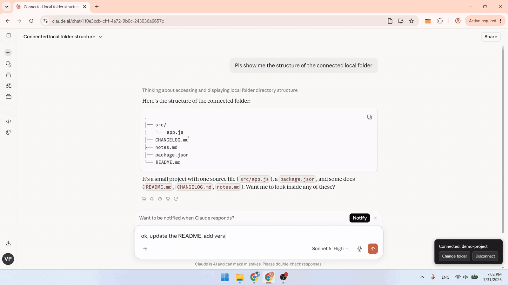

# claudeFS

Connect a local folder to [claude.ai](https://claude.ai) — the "FS" stands for file system. A browser extension (MV3) for Chrome and Edge: authorize a folder once, and Claude can read, search, and edit the files in it right from the chat — no desktop app, no API key, no command line. Works on the free claude.ai plan.

**Who it's for:** anyone whose work lives in a pile of text files — code, Markdown, notes, drafts — and who wants to keep discussing them with Claude in the browser instead of re-uploading them every session. It complements terminal and IDE tools rather than replacing them: the chat side stays for thinking and review, while the files are always current and conclusions get written straight back.

▶ [Watch the full demo (90s)](https://youtu.be/j7PDsVeVXGw)

[English](#english) | [中文](#中文)

## English

### Getting Started

**Prerequisites:** a Chromium-based browser (Chrome, Edge, etc.) with Manifest V3 and File System Access API support, plus a [claude.ai](https://claude.ai) account.

### Install

- **Chrome:** install from the [Chrome Web Store](https://chromewebstore.google.com/detail/claudefs/dgejoeopjlibbnbglaheaokkhmddedcf).
- **Edge:** install from the [Microsoft Edge Add-ons store](https://microsoftedge.microsoft.com/addons/detail/claudefs/mfngoeppdmboplcgllagnnggehdcigna).
- **From source:** clone or download this repository (no build step needed), then load the `src/` folder via Developer mode → "Load unpacked".

### Use

1. Open [claude.ai](https://claude.ai).
2. Click the connect button at the bottom right of the page and pick a local folder.
3. Ask Claude something like "read xx file" — that's it.

> Tip: the file tools only appear in Claude's available tool list after it discovers them — if Claude doesn't use the tools at first, rephrase and mention file operations explicitly.

### Privacy

All file operations run locally in your browser; the extension itself sends nothing to any server. File content that Claude reads via the tools goes only into your claude.ai conversation — the same as if you had pasted or uploaded it there yourself. Your folder reference is stored only in the browser's local storage (IndexedDB). Full policy: [PRIVACY.md](./PRIVACY.md).

### Safety

Every write operation (write / edit / move / delete, etc.) shows a diff confirmation dialog before touching your disk — you review the change and decide whether to approve it.

### Limitations

The text tools are text-only: read, search, and edit work on plain-text files (code, Markdown, JSON, CSV, etc.). Images and audio are handled separately by `read_media_file`, which hands them to Claude as native image/audio content. Office documents (docx / xlsx / pptx) and PDFs are not supported — use claude.ai's own file upload for those. Most per-file operations are capped at 5 MB.

### Disclaimer

claudeFS is an independent open-source project, not affiliated with or endorsed by Anthropic. Claude is a trademark of Anthropic.

### License

MIT — see [LICENSE](./LICENSE).

## 中文

一个支持 Chrome 与 Edge 的浏览器扩展（MV3，名字中的 FS 即 file system 文件系统），让你在 [claude.ai](https://claude.ai) 授权一个本地文件夹后，Claude 能像 agent 一样直接读写该文件夹里的文件——零安装、无 API Key、无命令行，claude.ai 免费版即可使用。

**适合谁用：**工作内容是一堆文本文件的人——代码、Markdown、笔记、草稿——想在浏览器里持续和 Claude 讨论这些文件，而不是每开一次新对话就重新上传一遍。它与终端和 IDE 里的工具是互补分工：对话端负责思考与审阅，文件始终是最新的，讨论结论能直接写回文件夹。

### 快速开始

**前置条件：**一个支持 Manifest V3 与 File System Access API 的 Chromium 内核浏览器（Chrome、Edge 等），以及一个 [claude.ai](https://claude.ai) 账号。

### 安装

- **Chrome：**从 [Chrome 应用商店](https://chromewebstore.google.com/detail/claudefs/dgejoeopjlibbnbglaheaokkhmddedcf) 直接安装。
- **Edge：**从 [Microsoft Edge 扩展商店](https://microsoftedge.microsoft.com/addons/detail/claudefs/mfngoeppdmboplcgllagnnggehdcigna) 直接安装。
- **源码安装：**克隆或下载本仓库（无需构建），在开发者模式下"加载已解压的扩展程序"，选择 `src/` 文件夹。

### 使用

1. 打开 [claude.ai](https://claude.ai)。
2. 点击页面右下角的连接按钮，选择要授权的本地文件夹。
3. 对 Claude 说"读一下 xx 文件"之类的话即可。

> 提示：文件工具需要 Claude 先检索到，才会出现在它当次对话可用的工具列表里——如果它一开始没用工具，换个更明确提到文件操作的说法再试一次。

### 隐私

所有文件操作都在你本地浏览器完成，扩展自身不向任何服务器传输任何数据；Claude 通过工具读到的文件内容，只会进入你正在使用的 claude.ai 对话（等同于你手动粘贴/上传给 Claude）。你选的文件夹引用仅保存在浏览器本地存储（IndexedDB）中。完整政策见 [PRIVACY.md](./PRIVACY.md)。

### 安全

所有写操作（write / edit / move / delete 等）执行前都会弹出 diff 确认，你可以查看改动内容后再决定是否放行。

### 限制

文本工具仅限纯文本：读取、搜索、编辑只处理纯文本文件（代码、Markdown、JSON、CSV 等）。图片与音频由 `read_media_file` 单独支持，会作为原生的图片／音频内容交给 Claude。Office 文档（docx / xlsx / pptx）与 PDF 不支持——这类文件请走 claude.ai 自身的上传功能。多数单文件操作有 5MB 大小上限。

### 免责声明

本项目并非 Anthropic 官方产品，与 Anthropic 无关联、未获其背书。Claude 是 Anthropic 的商标。

### License

MIT，见 [LICENSE](./LICENSE)。
